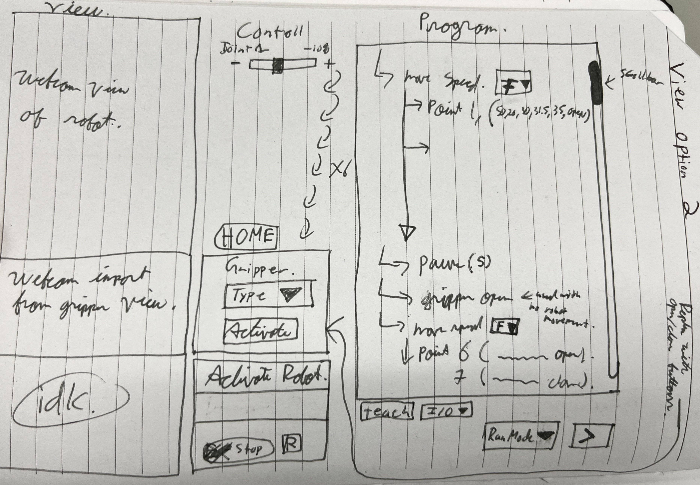
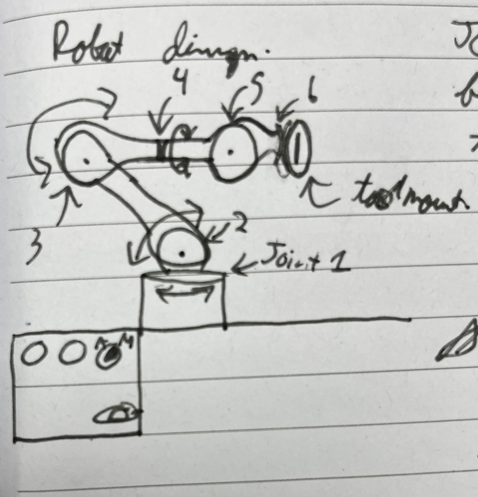

# Robot-GUI
GUI for controlling and interfacing with an external robotic arm. This program is to be run on a pi with an external 6 axis robotic arm. 

### My Plan
My goal is to create a GUI for simulating and controlling a 6 axis robotic arm. I have created a section for viewing the robot, a section for controlling and activation, and a section for the program tree. 
I have no idea how to do this and I have never used python or the tkinter GUI library before so this will be fun. 

### How to Use
There is a single executable file (application file) that can be opened to run this program.
or run in vs code after importing 'tkinter', 'customtkinter', 'PIL Image'. This is designed to eventually be uploaded to a Pi with an external display and motor controllers. 
 

### The program

<!-- include small pictures -->
The program opens with an activate button. Once the robot is activated, there is a cameare view of the robot on thr right. Followed by a robot controlls section in the middle, and a program tree on the right side.

There are 2 camera views on the left side. One that allows for a larger isometric view of the robot and a second that allows for the gripper camera to be displayed. The joint position sliders and +/- buttons allow for setting the target position of the joints. The labels update the current position of the robots joints. The gripper selection section allows the user to select the active type of gripper and controll the opening and closing. The program tree on the right allows the user to program the robot with the teach and I/O buttons. The program can be run once a runmode is selected and the run button ('>') is pressed. There is a stop and reset button for if something goes wrong. 

<!-- I want to have a scrollable area for the program. This would include a teach button, runMode dropdown and run button. In the future I plan to have a I/O dropdown for gripper movements and I/O options
I plan to have a drop down with a run selection mode, this run selection mode also has a run button so that I can select if I want to run step by step and have to press run for the robot to go to then next taught position, or to run automatically through all the steps.  -->

# About The Robot
6 axis robotic arm with a interchangeable gripper plate. 

Included joints and their naming scheme and function 
| Joint Name | Number | Function|
| :---------:|:------:|:-------:|
| base     |    1       |    to rotate the robot around the base   |
| shoulder   | 2        |To rotate the arm up and down|
|  elbow |  3 |  to rotate the elbow up and down |
|  forearm |  4 |  rotate forearm around |
| wrist1  |  5 |  rotate tool up and down |
| wrist2  |  6 | to rotate the tool  |

End of arm tooling options
|Gripper Name| Style|Gripper Function|
|:----------:|:----:|:----:|
|3 Finger Gripper|centre in 2 directions| 3 fingers that moving towards eachother to close|
|Parallel Gripper| centre in 1 direction|2 parallel jaws that move towars eachother to close|
|Vacuum Gripper| centre vertically to suction cup| suction cup to create negative air pressure and adhere object to 1 or more cups|

### Controlling Robotic Arm
I have started the file named 'RobotCode' where the 
I am going to have a target x and a current x, I set the target x to be the x of the slider(1 decimal place) and the current x comes from encoders, the percent displayed is the current robot positions, there is a 'wait for' command between the steps to make sure the robot reaches the target within a tolerance before moving in to the next. Depending on the motors and drivers used, PID tuning may be used to increase the precision and decrease the joint stress and movement time. 

### List Of Steps
- [x] create initial readme file 
- [x] create and test the main application with a simple button and frame
- [x] add pseudocode and placeholder comments for future use
- [x] create the frame layout
- [x] create the activate and connection sequence. 
- [x] create functions for the sliders
- [x] add + and - buttons with set values per joint
- [x] convert the function to a class
- [x] add a 'home' button to reset the robot and sliders back to home position
- [x] add webcam for view of the robot
- [x] add gripper activation, selection and controlls 
- [x] add scrollable capability to the program frame
- [x] add a teach button and runmode dropdowns and '>' button for the robot to run the program
- [ ] add class/function for program
- [ ] add button for adding I/O controlls like setting gripper to be open or closed
- [ ] allow for changes in program tree once the program has been made or during the process
- [ ] add file drowdown and a save button to save the program
- [ ] add a close under the save to deactivate robot, lock joints and close the application
- [ ] create the .exe application file
- [ ] write all the robot code to interact with the gui
- [ ] make this Pi friendly and able to fully opperate from 1 pi and touch display

# Future Plans
### GUI Future Plans
There is a lot to improve to say the least. The code is terribly inneficient and takes a long time to open the fairly simple program. I still need to add in another webcam for the gripper view. This would include adding another parameter to the calss for if the gripper has a camera or not. I also need to add more to the program tree to allow for more complex programming with the addition of I/O integration and boolean logic. This would allow the robot to better integrate with external devices. 
### Robot Code Future Plans
Well there are a lot. 'RobotCode' was mostly created as a placeholder file for where all the robot code will eventually go. This file is far from complete and only includes some basic functions that are required for the GUI to function. There is often a console log in place of robot opperations. I still need the initial robot startup sequence and homing, and also ensure integration with the GUI is working.